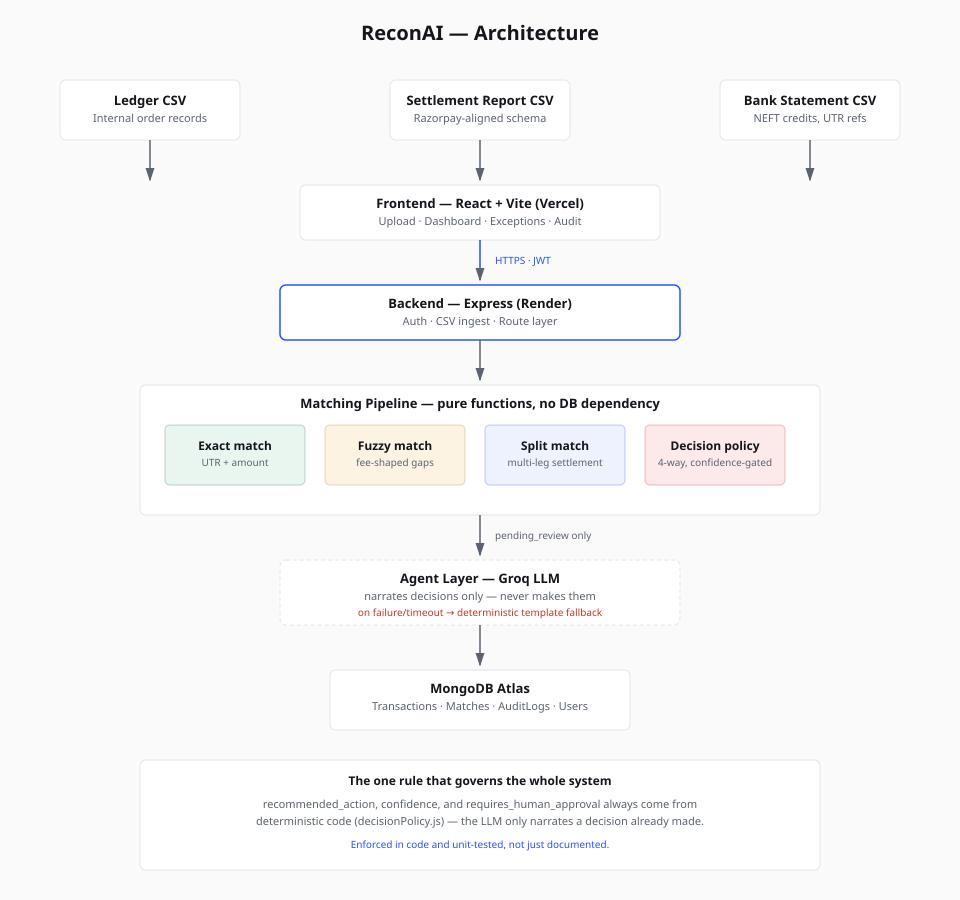

# ReconAI

**Autonomous reconciliation for merchant finance operations — built for the Razorpay AI Buildathon 2026.**

**🔗 Live demo:** https://frontend-pi-sepia-94.vercel.app · **API:** https://reconai-uodo.onrender.com

*(Backend is on Render's free tier and spins down after 15 minutes idle — the first request after inactivity may take 30-60s to wake up. If the demo looks slow, that's why, not a bug.)*

A finance/ops person at a mid-size merchant spends hours every settlement cycle manually cross-checking three sources — bank credits, the Razorpay settlement report, and internal order records — to find which orders got paid, which were short-settled, and which never landed. ReconAI does that matching automatically: it resolves what it's confident about, explains what it isn't, and never silently drops an order.

---

## The problem, concretely

Every settlement cycle, a finance analyst reconciles:
- **Bank statement** — what actually landed, with a UTR reference and a messy narration line
- **Settlement report** — Razorpay's record of what was paid out, with fees and tax deducted
- **Internal ledger** — what the business thinks it's owed

These three sources disagree in predictable, recurring ways: fees the settlement report forgot to itemize, orders settled across two separate payouts, payments that simply haven't landed yet, duplicate bank entries. Today, someone finds these by eye, in a spreadsheet, every cycle.

## What ReconAI does

1. **Matches** — exact matching first (order ID + UTR + verified amount), then fuzzy matching for fee-shaped discrepancies, then split-settlement matching for orders paid across multiple records
2. **Scores confidence** — every match gets a deterministic 0–1 confidence score; nothing is a guess dressed up as a percentage
3. **Decides** — a 4-way decision policy (`auto_resolve` / `escalate_high_value` / `request_more_data` / `flag_for_review`) routes every single order to an explicit outcome, matched or not
4. **Explains** — unresolved exceptions get a plain-English explanation from an LLM (Groq), with a deterministic template fallback if the API is unavailable
5. **Logs everything** — every automatic and human decision writes a timestamped, reproducible audit entry

**The one rule that governs the whole system:** the LLM never decides anything. `recommended_action`, `confidence`, and `requires_human_approval` always come from deterministic code (`decisionPolicy.js`) — the LLM only narrates a decision that's already been made. This is enforced in code, not convention, and is unit-tested (`tests/explainException.test.js`) against a hypothetical LLM response that tries to override these fields.

---

## Results — reproducible, not claimed

```
node evaluate.js
```

Runs the real matching pipeline against a labeled synthetic dataset (see `data/generate_data.py`) and reports:

| Metric | Result |
|---|---|
| Overall match-type classification accuracy | **100%** |
| Auto-resolve precision (of everything resolved without a human, % correct) | **100%** |
| Reconciliation recall (of genuinely reconcilable orders, % caught) | **100%** |
| Safety check — not-yet-settled orders ever auto-resolved | **0 / PASS** |

Verified across two independent seeds and sample sizes (n=100, n=250) with identical results — this isn't one lucky run. Full numbers: `data/sample_batch/evaluation_results.json`.

**What this does and doesn't prove:** the engine correctly implements its own design — every documented discrepancy category is caught with zero false positives and zero false negatives. It is not a claim about generalization to real-world discrepancy patterns beyond the five categories modeled here. See Limitations below.

---

## Architecture



The matching engine (`backend/src/services/matching/`) takes plain arrays in, returns plain objects out — no Mongoose, no HTTP, no I/O. This is why it could be built and exhaustively unit-tested (23 tests across 5 suites) before a single line touched the database, and why a Day 6 settlement-schema rename (see below) required changing exactly one file.

## Tech stack

- **Backend:** Node.js, Express, MongoDB Atlas (Mongoose)
- **Frontend:** React, Vite, Tailwind CSS, self-hosted IBM Plex Sans/Mono (no external font CDN dependency at demo time)
- **LLM:** Groq (`openai/gpt-oss-20b`), reasoning effort tuned low for latency, hard 8s timeout, deterministic template fallback on any failure
- **Testing:** Jest, 23 tests across matching, scoring, and agent layers

---

## Razorpay integration

`settlement_report.csv`'s schema (`entity_id`, `settlement_id`, `settlement_utr`, `amount`, `fee`, `tax`, `credit`) is aligned to Razorpay's real documented Settlement Recon API field names, not invented. Full sourcing and the one disclosed simplification (this project models one order settled across multiple legs, rather than Razorpay's more common pattern of many orders sharing one settlement batch) are in [`docs/razorpay-schema-notes.md`](docs/razorpay-schema-notes.md).

No live Razorpay API is called — settlement data is a Test-Mode-shaped CSV, explicitly labeled as a simulation rather than a production integration.

---

## Running it locally

**Backend:**
```bash
cd backend
npm install
# .env: MONGODB_URI, JWT_SECRET, GROQ_API_KEY, PORT=5000
npm run dev
```

**Frontend:**
```bash
cd frontend
npm install
npm run dev
```

**Generate the demo dataset:**
```bash
cd data
python generate_data.py --n 100 --seed 42 --out sample_batch
```

**Run the evaluation:**
```bash
cd backend
node evaluate.js
```

**Run the test suite:**
```bash
cd backend
npm test
```

---

## Repository structure

```
reconai/
├── backend/
│   ├── src/
│   │   ├── models/         # Mongoose schemas (User, Batch, Transaction, Match, AuditLog)
│   │   ├── routes/         # Express routes (auth, batches, matches)
│   │   ├── services/
│   │   │   ├── matching/   # exact/fuzzy/split engines + CSV parsing (pure functions, no DB)
│   │   │   ├── scoring/    # confidence math + the 4-way decision policy
│   │   │   └── agent/      # LLM explainer, template fallback
│   │   └── middleware/     # auth, error handling
│   ├── tests/               # 23 tests across 5 suites
│   ├── scripts/             # pipeline sanity-check scripts (Day 4/5 design verification)
│   └── evaluate.js          # reproducible precision/recall evaluation (see Results)
├── frontend/
│   └── src/
│       ├── pages/            # Landing, Login, Upload, Dashboard, Exceptions, Audit
│       └── components/       # ConfidenceBar, badges, states — the shared visual language
├── data/
│   ├── generate_data.py     # synthetic dataset generator with labeled ground truth
│   └── sample_batch/         # the locked, seeded demo dataset (seed=42, n=100)
└── docs/
    └── razorpay-schema-notes.md
```

**Also in `docs/`:** [`architecture.svg`](docs/architecture.svg) (the diagram above, as source) and [`judge-qa.md`](docs/judge-qa.md) — 25 anticipated questions answered against what was actually built, including real bugs found and fixed during the build rather than a cleaned-up narrative.

---

## Limitations

Stated plainly, not hidden:

- **Synthetic data.** No real merchant reconciliation data was available or appropriate to use; the dataset is generated with known, labeled ground truth instead (`data/generate_data.py`), which is what makes the evaluation results above provable rather than asserted.
- **Settlement model is simplified.** Real Razorpay settlements typically batch many orders into one settlement ID and one bank UTR; this project models the reverse (one order across multiple settlement legs). See `docs/razorpay-schema-notes.md` for the reasoning behind this scoping decision.
- **`evaluate.js`, not `evaluate.py`.** The entire matching engine is JavaScript; a Python evaluation script would need to shell out to Node (or vice versa) for zero benefit. Same category of disclosed, reasoned deviation as the settlement-model simplification above.
- **LLM explanations are advisory only.** They narrate a decision already made deterministically; they never influence `recommended_action`, `confidence`, or `requires_human_approval` (enforced in code and unit-tested).
- **Sequential per-order writes.** Each order's match and audit log write to MongoDB sequentially rather than batched, adding roughly 1–2s of processing time per order on a cold connection. Fine at hackathon-demo batch sizes; noted as the first thing to optimize before scaling batch size significantly.
- **No live Razorpay API integration.** Settlement data is a Test-Mode-shaped CSV, not a production API pull — labeled as a simulation throughout, not presented as live production behavior.

## What's next

With more time: a real Razorpay Settlement API pull instead of a CSV upload, settlement-ID as the true batch key (matching Razorpay's actual batching model), multi-tenant support, and moving the sequential per-order pipeline to a background job queue for larger batch sizes.
